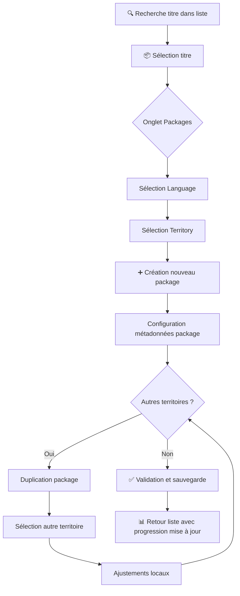
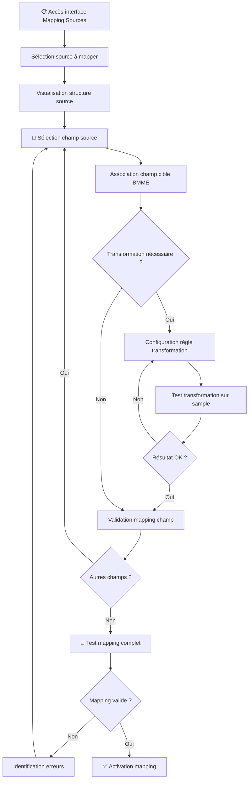
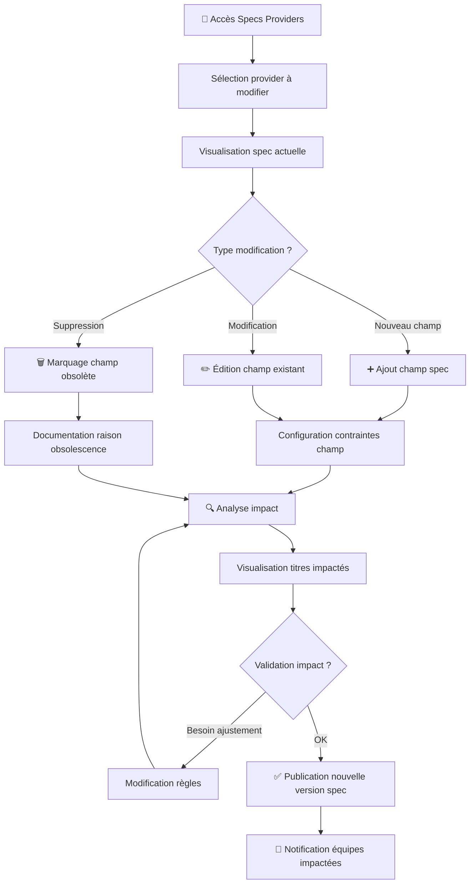

# UX Design Specification - BMME v2

**Author:** Ben
**Date:** 2026-03-19

---

## Executive Summary

### Project Vision

**BMME v2** (BundleMaker Metadata Editor v2) est le nouveau module de gestion des métadonnées SVOD de la plateforme mediaspot. Il remplace VDM Connect (système legacy externe, plus maintenu depuis plusieurs années) et pose les fondations pour BundleMaker v2.

**Promesse de valeur UX :** Transformer une tâche de 2-3 jours en 3 heures grâce à une interface centralisée, un héritage intelligent des métadonnées et un feedback temps réel.

**Objectifs stratégiques :**

- Centraliser la gestion des métadonnées en une seule interface (fin du jonglage entre 3 outils)
- Automatiser la propagation des métadonnées (héritage Title → Langues → Territoires)
- Garantir la qualité des livraisons providers (validation temps réel contre specs)
- Donner aux équipes internes VDM des outils de monitoring et configuration no-code

### Target Users

BMME v2 cible trois personas distincts avec des besoins et workflows très différents :

| Persona | Rôle | Contexte quotidien | Pain Point Principal |
|---------|------|----------|---------------------|
| **Sophie Dubois** | Gestionnaire Catalogue (client) | Crée packages multi-territoires pour 4 providers, gère 200 films | "Je ressaisis 15 fois les mêmes informations pour chaque territoire" |
| **Marc Lefebvre** | Admin Interne VDM | Maintient synchronisations entrantes (Unity, Iron, MovieLibrary) | "1 journée pour diagnostiquer un problème de synchro, sans outil de monitoring" |
| **Julie Martin** | Technicienne Labo VDM | Maintient specs providers (iTunes, Amazon, Google, Netflix) | "47 fichiers XML dispersés à modifier pour chaque changement de spec" |

**Verbatims clés des interviews :**

> "La qualité de la livraison est un sujet de pression" — Violaine Terroni (150 packages/mois, 90% vérification manuelle)

> "L'objectif est d'éteindre VDMConnect" — Yan Rocheteau

> "Le labo est souvent la roue de secours de mediaspot" — Yan Rocheteau

### Key Design Challenges

| Défi UX | Description | Impact |
|---------|-------------|--------|
| **Hiérarchie à 4 niveaux** | Title → Languages → Territories → Packages avec héritage et overrides | Navigation complexe, risque de confusion sur "où suis-je ?" |
| **3 audiences très différentes** | Clients (Sophie) vs Admin (Marc) vs Labo (Julie) avec workflows distincts | Interfaces distinctes ou unifiées ? Besoin de cohérence sans compromis |
| **Validation temps réel sans friction** | Feedback immédiat sur complétion et conformité specs | Balance entre aide et interruption du flow de travail |
| **Éditeur de mapping accessible** | Utilisateurs non-devs doivent configurer transformations de données | Abstraction visuelle du code sans perte de puissance |
| **Migration depuis VDM Connect** | Utilisateurs habitués à l'ancien système depuis des années | Courbe d'apprentissage, besoin de "moments aha!" rapides |

### Design Opportunities

| Opportunité | Valeur créée | Persona principal |
|-------------|--------------|-------------------|
| **Vue bulk de localisation** | Voir/éditer 15 territoires en 1 écran vs 15 écrans séparés | Sophie |
| **Compteur de complétion visuel** | "94/120 champs remplis" → confiance immédiate | Sophie |
| **Preview des changements** | Voir l'impact AVANT d'appliquer une synchro ou un mapping | Marc, Julie |
| **Éditeur de mapping no-code** | Déploiement en 25 min vs demi-journée + CI/CD | Julie |
| **Source tracking transparent** | Comprendre d'où vient chaque donnée, arbitrer entre sources | Sophie, Marc |
| **Dashboard de monitoring** | Détection proactive des problèmes de synchro avant plainte client | Marc |

## Core User Experience

### Defining Experience

BMME v2 est un **écosystème de 3 workflows interconnectés**, pas un outil monolithique. Les trois personas travaillent en silo mais s'enablent mutuellement :

```
┌─────────────────────────────────────────────────────────────────┐
│                    BMME v2 - Écosystème                         │
├─────────────────────────────────────────────────────────────────┤
│                                                                 │
│   Julie (Labo)              Marc (Admin)           Sophie       │
│   ┌─────────────┐          ┌─────────────┐       ┌───────────┐ │
│   │ Specs       │          │ Synchro     │       │ Packages  │ │
│   │ Providers   │ ──────▶  │ Entrantes   │ ───▶  │ Multi-    │ │
│   │ (sortant)   │          │ (entrant)   │       │ territoires│ │
│   └─────────────┘          └─────────────┘       └───────────┘ │
│         │                        │                     │        │
│         │    Source of Truth     │                     │        │
│         └────────────────────────┴─────────────────────┘        │
│                                                                 │
└─────────────────────────────────────────────────────────────────┘
```

**Flux de valeur :**

- **Julie** maintient les specs providers → Marc et Sophie ont des mappings fiables
- **Marc** assure la synchro des sources externes → Sophie a des métadonnées à jour
- **Sophie** crée des packages validés → Les livraisons sont conformes (grâce à Julie)

**Action core par persona :**

| Persona | Action Core | Fréquence | Durée cible |
|---------|-------------|-----------|-------------|
| **Sophie** | Créer un package complet multi-territoires | Quotidienne | < 15 min/package |
| **Marc** | Diagnostiquer et résoudre un problème de synchro | Hebdomadaire | < 40 min |
| **Julie** | Mettre à jour une spec provider et déployer | Mensuelle | < 25 min |

### Platform Strategy

**Environnement technique :**

| Aspect | Décision | Justification |
|--------|----------|---------------|
| **Plateforme** | Web uniquement | Intégration native dans mediaspot existant |
| **Device** | Desktop-first | Vues bulk, tableaux de mapping, dashboards nécessitent écran large |
| **Input** | Souris/clavier | Pas de touch, optimisation raccourcis clavier |
| **Connectivité** | Online obligatoire | Données centralisées, pas de mode offline |
| **Contexte** | Brownfield | Intégration dans architecture mediaspot existante |

**Contraintes d'intégration :**

- Multi-tenant strict (isolation données par plateforme client)
- Réutilisation auth/ACL existants de mediaspot
- Cohabitation temporaire avec VDM Connect et PackageEditor legacy

### Effortless Interactions

**Ce qui doit être invisible/automatique :**

| Interaction | Comportement effortless |
|-------------|------------------------|
| **Héritage des métadonnées** | Propagation automatique Title → Langues → Territoires, override uniquement si explicitement voulu |
| **Localisation multi-territoire** | Vue bulk unique avec toutes langues en colonnes, pas 15 écrans séparés |
| **État de complétion** | Compteur "94/120" toujours visible, pas besoin de chercher |
| **Identification des manques** | Champs requis manquants en rouge en temps réel, pas de découverte tardive |
| **Traçabilité des sources** | Icône source sur chaque champ, historique accessible en 1 clic |
| **Déploiement des mappings** | Test → Déployer en 1 clic, pas de commit/CI-CD/intervention dev |

### Critical Success Moments

**Moments make-or-break par persona :**

| Persona | Moment critique | Critère de succès | Conséquence si raté |
|---------|-----------------|-------------------|---------------------|
| **Sophie** | Premier package créé | "120/120 - VALID" en < 15 min | Retour à VDM Connect, échec d'adoption |
| **Marc** | Premier diagnostic de synchro | Problème identifié en < 5 min via dashboard | Perte de confiance, retour aux logs manuels |
| **Julie** | Première mise à jour de spec | Test + déploiement sans intervention dev | Dépendance maintenue sur équipe tech |
| **Tous** | Migration depuis VDM Connect | Données importées sans perte, repères familiers | Résistance au changement, double saisie |

### Experience Principles

**Principes directeurs pour toutes les décisions UX :**

| Priorité | Principe | Implication concrète |
|----------|----------|---------------------|
| **#1** | **"Je suis autonome"** | No-code pour les configs, pas de dépendance dev/CI-CD, auto-suffisance totale |
| **#2** | **"Je sais où j'en suis"** | Feedback visuel permanent (compteurs, états, sources, progression) |
| **#3** | **"Je ne ressaisis jamais la même chose"** | Héritage intelligent, propagation automatique, reasonable defaults |
| **#4** | **"Je vois avant d'agir"** | Preview des changements, test avant déploiement, pas de surprise |
| **#5** | **"Je peux toujours comprendre"** | Source tracking, historique détaillé, logs friendly et contextuels |

**L'autonomie comme principe cardinal :** Chaque persona doit pouvoir accomplir son workflow complet sans dépendre d'une autre équipe (dev, ops, support). C'est la promesse fondamentale de BMME v2.

## Desired Emotional Response

### Primary Emotional Goals

**Transformation émotionnelle visée par BMME v2 :**

| État émotionnel actuel | État émotionnel cible | Déclencheur UX |
|------------------------|----------------------|----------------|
| **Anxiété** (avancer à l'aveugle) | **Confiance** | Compteur "120/120 VALID" visible en temps réel |
| **Frustration** (tâches répétitives) | **Flow** | Héritage automatique, vue bulk |
| **Incertitude** (d'où vient cette donnée ?) | **Contrôle** | Source tracking, preview des changements |
| **Dépendance** (attendre le dev) | **Autonomie** | No-code, déploiement en 1 clic |
| **Tedium** (47 fichiers à modifier) | **Efficacité** | 25 min au lieu de demi-journée |

### Emotional Journey Mapping

**Objectifs émotionnels par persona :**

| Persona | Émotion primaire | Moment déclencheur | Citation rêvée |
|---------|------------------|-------------------|----------------|
| **Sophie** | **"Je maîtrise"** | Voir le compteur passer à VALID | "Putain, c'est génial! Avant je devais ouvrir 15 écrans séparés!" |
| **Marc** | **"Je vois tout"** | Dashboard avec statut temps réel | "Problème identifié en 5 min, pas 1 journée" |
| **Julie** | **"C'est rapide et sûr"** | Test mapping → Déployer en 1 clic | "25 min au lieu d'une demi-journée, sans toucher au code" |

**Parcours émotionnel type (Sophie) :**

```
Découverte          Core Experience         Accomplissement        Retour
    │                     │                       │                  │
    ▼                     ▼                       ▼                  ▼
"Oh, ça hérite    →  "Je vois ma         →  "120/120 VALID,   →  "J'ai fait 3
automatiquement!"    progression!"           en 15 min!"          packages
                                                                  aujourd'hui!"
    │                     │                       │                  │
 Surprise            Contrôle               Accomplissement      Fierté
 positive            + Flow                 + Soulagement        + Efficacité
```

### Micro-Emotions

**Micro-émotions critiques à cultiver :**

| Micro-émotion | Importance | Comment la cultiver |
|---------------|------------|---------------------|
| **Confiance** vs Doute | ⭐⭐⭐ | Validation temps réel, feedback immédiat, états clairs (VALID/INVALID) |
| **Contrôle** vs Chaos | ⭐⭐⭐ | Hiérarchie claire, breadcrumb "où suis-je", navigation prévisible |
| **Accomplissement** vs Frustration | ⭐⭐ | Progression visible, compteurs, célébration discrète du succès |
| **Sérénité** vs Anxiété | ⭐⭐ | Preview avant action, possibilité de rollback, pas de surprise |
| **Fierté** vs Honte | ⭐ | "Zéro erreur à la livraison" comme résultat visible |

### Emotions to Avoid

**Émotions négatives à éviter absolument :**

| Émotion négative | Situation déclenchante | Stratégie d'évitement |
|------------------|----------------------|----------------------|
| **Confusion** | "Où suis-je dans cette hiérarchie ?" | Breadcrumb permanent, indicateurs de niveau visuels |
| **Panique** | Erreur de synchro détectée trop tard | Alertes proactives, dashboard de monitoring |
| **Impuissance** | "Je dois attendre le dev pour déployer" | No-code partout, autonomie totale |
| **Méfiance** | "D'où vient cette donnée ?" | Source tracking transparent sur chaque champ |
| **Surcharge** | "Trop d'informations à l'écran" | Progressive disclosure, focus sur l'essentiel, vues adaptées au contexte |

### Emotional Design Principles

**Principes de design émotionnel :**

| Principe | Application concrète |
|----------|---------------------|
| **Feedback immédiat** | Chaque action utilisateur génère une réponse visuelle instantanée (compteur qui s'actualise, validation en temps réel) |
| **Progression visible** | L'utilisateur voit toujours où il en est et ce qui reste à faire (compteur "94/120", état VALID/INVALID) |
| **Prévention des erreurs** | Validation live, champs manquants en rouge AVANT soumission, pas de découverte tardive |
| **Récupération gracieuse** | Preview des changements, possibilité de rollback, historique accessible |
| **Célébration discrète** | État "VALID" clairement visible, mais pas de confetti intrusif — satisfaction sobre et professionnelle |

**Verbatim cible post-adoption :**

> "Je SAIS que c'est bon. Je n'attends plus la livraison pour découvrir les erreurs." — Sophie (Journey 1, PRD)

## UX Pattern Analysis & Inspiration

### Inspiring Products Analysis

**Contexte utilisateur clé : Excel comme référence mentale**

Les utilisateurs BMME v2 (notamment Sophie et son équipe) passent beaucoup de temps dans Excel. Cela implique :

- Familiarité avec les interfaces en grille/tableau
- Attente d'édition inline rapide (clic → saisie)
- Habitude des raccourcis clavier (Tab, Enter, flèches)
- Confort avec le bulk editing (sélection multiple, copier-coller)
- Moins de familiarité avec les hiérarchies profondes (Excel est "plat")

**Produits inspirants sélectionnés :**

| Produit | Pertinence pour BMME v2 | Pattern clé à extraire |
|---------|------------------------|----------------------|
| **Airtable** | Vue bulk, édition multi-cellules | Grid view avec filtres, vues, édition inline |
| **Notion** | Hiérarchie à niveaux | Pages imbriquées, breadcrumb, sidebar |
| **Zapier / Make** | Éditeur de mapping | Visual flow builder, transformations no-code |
| **Datadog / Grafana** | Dashboard monitoring | Widgets temps réel, alertes, logs structurés |
| **Linear** | Feedback temps réel | États clairs, micro-interactions, rapidité |
| **Git / GitHub** | Source tracking | Blame view, historique, diff |

### Transferable UX Patterns

**1. Patterns de navigation (Hiérarchie)**

| Pattern | Source | Application BMME v2 |
|---------|--------|---------------------|
| **Breadcrumb persistant** | Notion, Finder | Title > English > United Kingdom — toujours visible |
| **Sidebar arborescente** | Notion, VS Code | Navigation rapide entre niveaux sans perdre le contexte |
| **Tabs horizontaux** | Airtable | Switcher entre Metadata / Languages / Territories / Packages |

**2. Patterns d'édition bulk (Sophie)**

| Pattern | Source | Application BMME v2 |
|---------|--------|---------------------|
| **Grid view éditable** | Airtable, Excel | Vue bulk localisation avec langues en colonnes |
| **Inline editing** | Airtable, Notion | Clic sur cellule → édition directe, pas de modale |
| **Multi-select + action** | Airtable, Gmail | Sélectionner plusieurs territoires → appliquer une valeur |
| **Keyboard navigation** | Excel | Tab/Enter/Flèches pour naviguer, Ctrl+C/V pour copier |
| **Filtres persistants** | Airtable | Filtrer par état (incomplet, valid, etc.) |

**3. Patterns de mapping visuel (Julie, Marc)**

| Pattern | Source | Application BMME v2 |
|---------|--------|---------------------|
| **Visual connector** | Zapier, Make | Ligne reliant champ source → champ destination |
| **Transformation preview** | Make | Voir le résultat de la transformation en temps réel |
| **Test avec données réelles** | Postman | "Test mapping" sur un package réel avant déploiement |
| **Drag & drop mapping** | ETL tools | Glisser un champ source vers un champ destination |

**4. Patterns de monitoring (Marc)**

| Pattern | Source | Application BMME v2 |
|---------|--------|---------------------|
| **Status badges** | Datadog | 🟢 Synced / 🔴 Failed / 🟡 Warning |
| **Timeline view** | Grafana | Historique des synchros avec succès/échecs |
| **Log expansion** | Datadog | Clic sur une erreur → détail contextuel |
| **Alertes proactives** | PagerDuty | Badge rouge "3 synchros échouées" dès le dashboard |

**5. Patterns de feedback (Tous)**

| Pattern | Source | Application BMME v2 |
|---------|--------|---------------------|
| **Progress indicator** | Linear | Compteur "94/120" avec barre de progression |
| **Instant validation** | Form UX | Champ valide = ✓ vert, invalide = ✗ rouge, en temps réel |
| **Diff view** | GitHub | Preview des changements avant application (Old → New) |
| **Toast notifications** | Linear | Confirmation discrète des actions ("Mapping saved") |

### Anti-Patterns to Avoid

| Anti-pattern | Risque | Alternative |
|--------------|--------|-------------|
| **Modale dans modale** | Perte de contexte, confusion | Utiliser des panels latéraux ou expansion inline |
| **Formulaire pleine page** | Rupture de flow, perte de contexte | Édition inline ou panel latéral avec vue d'ensemble |
| **Navigation cachée** | "Où suis-je ?" | Breadcrumb + sidebar toujours visibles |
| **Validation uniquement à la soumission** | Découverte tardive des erreurs | Validation temps réel champ par champ |
| **Wizard multi-étapes obligatoire** | Friction pour users experts | Accès direct à n'importe quelle section |
| **Icônes sans labels** | Courbe d'apprentissage élevée | Icônes + texte, au moins en hover |
| **Actions destructives sans confirmation** | Panique, perte de données | Preview + confirmation explicite |

### Design Inspiration Strategy

**Ce qu'on ADOPTE directement :**

| Pattern | Raison |
|---------|--------|
| Grid view éditable (Airtable) | Users connaissent Excel, transition naturelle |
| Breadcrumb persistant (Notion) | Résout "où suis-je" dans la hiérarchie |
| Inline editing (Airtable) | Rapidité, pas de rupture de flow |
| Status badges colorés (Datadog) | Feedback immédiat, compréhension instantanée |
| Diff view (GitHub) | Preview des changements, confiance avant action |

**Ce qu'on ADAPTE pour BMME v2 :**

| Pattern | Adaptation |
|---------|-----------|
| Visual flow builder (Zapier) | Simplifier pour des mappings tabulaires (pas de canvas complexe) |
| Dashboard widgets (Grafana) | Focus sur les 3-5 métriques clés, pas 20 widgets |
| Timeline (Grafana) | Adapter pour sync history, pas pour métriques continues |

**Ce qu'on ÉVITE :**

| Pattern évité | Raison |
|---------------|--------|
| Canvas infini (Miro, Figma) | Trop de liberté, pas adapté aux données structurées |
| Wizard obligatoire | Users experts veulent accès direct |
| Dark mode par défaut | Contexte pro, cohérence avec mediaspot existant |

## Design System Foundation

### Design System Choice

**Décision : Étendre le Design System mediaspot existant (MUI customisé)**

BMME v2 s'intègre dans l'écosystème mediaspot existant et doit respecter le Design Language System (DLS) en place.

| Aspect | État actuel | Implication BMME v2 |
|--------|-------------|---------------------|
| **Framework** | MUI (Material UI) | Utiliser les composants MUI existants |
| **Theme** | Custom, synchronisé Figma ↔ React | Réutiliser les tokens existants (couleurs, typographie, spacing) |
| **Design** | 1 designer dédié + lib Figma | Collaboration étroite pour nouveaux composants |
| **Contrainte** | Ne pas sortir du DLS | Aucune déviation, extension uniquement |

### Rationale for Selection

**Pourquoi cette approche est la bonne :**

| Raison | Bénéfice |
|--------|----------|
| **Cohérence plateforme** | BMME v2 ressemble à mediaspot, pas à un module étranger |
| **Vitesse de développement** | Composants existants réutilisables immédiatement |
| **Maintenance simplifiée** | Une seule source de vérité pour le design |
| **Onboarding facilité** | Users mediaspot existants retrouvent leurs repères |
| **Pas de dette technique** | Pas de framework concurrent à maintenir |

### Implementation Approach

**Stratégie d'implémentation :**

| Étape | Action |
|-------|--------|
| **1. Audit des composants existants** | Identifier ce qui est réutilisable tel quel |
| **2. Gap analysis** | Lister les composants manquants pour BMME v2 |
| **3. Extension du DLS** | Créer les nouveaux composants dans le respect du DLS |
| **4. Validation designer** | Chaque nouveau composant passe par le designer dédié |

### Customization Strategy

**Composants à étendre/créer pour BMME v2 :**

| Besoin BMME v2 | Composant MUI de base | Extension nécessaire |
|----------------|----------------------|---------------------|
| **Vue bulk localisation** | DataGrid | Édition inline multi-cellules, keyboard navigation |
| **Compteur de complétion** | LinearProgress + Typography | Composant composite "CompletionCounter" |
| **Source tracking badge** | Chip | Variantes par source (Unity, mediaspot, IMDb) |
| **Mapping editor** | Table + TextField | Composant "MappingRow" avec preview |
| **Sync status dashboard** | Card + Badge | Widget "SyncStatus" avec états colorés |
| **Diff view** | Table | Composant "DiffView" avec Old/New |
| **Breadcrumb hiérarchique** | Breadcrumbs | Extension pour 4 niveaux avec icônes |

**Tokens à valider/étendre :**

| Token | Usage BMME v2 | Action |
|-------|---------------|--------|
| **Couleurs sémantiques** | VALID (vert), INVALID (rouge), WARNING (jaune) | Vérifier existence dans theme |
| **États de champs** | Source locked, inherited, overridden | Potentiellement à créer |
| **Densité** | Vues bulk = compact, formulaires = normal | Utiliser les variants MUI existants |

### Component Library Extension Plan

**Nouveaux composants à créer (dans le DLS) :**

| Composant | Description | Priorité |
|-----------|-------------|----------|
| `<CompletionCounter />` | Affiche "94/120" avec barre de progression | P0 (MVP) |
| `<SourceBadge />` | Icône + tooltip indiquant la source d'une métadonnée | P0 (MVP) |
| `<InheritanceIndicator />` | Indique si valeur héritée ou overridden | P0 (MVP) |
| `<BulkEditGrid />` | DataGrid optimisé pour édition multi-cellules | P0 (MVP) |
| `<MappingEditor />` | Table source → destination avec transformations | P0 (MVP) |
| `<SyncStatusWidget />` | Card dashboard avec état synchro | P1 (Post-MVP) |
| `<DiffPreview />` | Vue Old → New pour preview des changements | P1 (Post-MVP) |

## Defining Experience

### The Core Promise

**"Une expérience de livraison bout-en-bout des plateformes VOD, homogène, maléable et agréable"**

Cette promesse définit l'identité UX de BMME v2. Chaque mot porte un engagement de design :

| Mot clé | Signification | Engagement UX |
|---------|---------------|---------------|
| **Bout-en-bout** | Couvre tout le workflow, de la saisie métadonnées à la livraison | Un seul outil, pas de fragmentation |
| **Homogène** | Même expérience, quel que soit le provider (iTunes, Amazon, Netflix, Google) | Interface unifiée, pas 4 outils différents |
| **Maléable** | Flexible, adaptable aux besoins spécifiques de chaque client/territoire | Customisation sans code, overrides intelligents |
| **Agréable** | Plaisir à utiliser, pas de friction ni d'anxiété | Feedback temps réel, confiance, autonomie |

### User Mental Model

**Comment les utilisateurs pensent leur travail aujourd'hui :**

| Modèle mental actuel | Problème | Modèle mental BMME v2 |
|---------------------|----------|----------------------|
| "Je dois jongler entre 3 outils" | Fragmentation | "Tout est au même endroit" |
| "Chaque provider a ses règles" | Complexité | "L'outil gère les règles pour moi" |
| "Je découvre les erreurs à la livraison" | Anxiété | "Je SAIS que c'est bon avant d'envoyer" |
| "Je dépends du dev pour les configs" | Impuissance | "Je suis autonome" |

**Métaphore mentale cible :**

> BMME v2 = "Mon cockpit de livraison VOD" — un poste de commande unique où je vois tout, contrôle tout, et ai confiance en tout.

### Success Criteria

**Quand sait-on que l'expérience est réussie ?**

| Critère | Indicateur observable | Mesure |
|---------|----------------------|--------|
| **Bout-en-bout** | Sophie fait tout dans BMME v2 sans ouvrir Excel/VDM Connect | 0 outil externe nécessaire |
| **Homogène** | Sophie utilise la même interface pour iTunes et Netflix | 0 changement de workflow entre providers |
| **Maléable** | Marc configure un nouveau mapping sans ticket dev | Temps de déploiement < 30 min |
| **Agréable** | Sophie dit "j'adore ce compteur" | NPS > 50, verbatims positifs |
| **Confiance** | Zéro erreur découverte à la livraison | Taux d'erreur post-livraison < 1% |
| **Autonomie** | Julie déploie une spec sans intervention dev | 100% des déploiements en self-service |

### Novel vs. Established Patterns

**Analyse des patterns utilisés :**

| Pattern | Type | Justification |
|---------|------|---------------|
| **Grid view éditable** | Établi (Excel, Airtable) | Familier aux users, pas besoin d'éducation |
| **Compteur de complétion temps réel** | Établi (formulaires web) | Attendu, mais rarement bien fait dans le B2B |
| **Héritage intelligent avec override** | **Semi-novel** | Concept familier (héritage CSS), mais application métier spécifique |
| **Source tracking par champ** | **Novel** | Besoin de micro-onboarding (tooltips, legend) |
| **Mapping editor no-code** | **Semi-novel** | Inspiré Zapier/Make, mais adapté au contexte tabulaire |

**Stratégie d'éducation pour les patterns novel :**

| Pattern novel | Mécanisme d'éducation |
|---------------|----------------------|
| **Source tracking** | Icône discrète + tooltip au hover, legend dans la sidebar |
| **Héritage avec override** | Indicateur visuel clair "inherited" vs "overridden", undo facile |
| **Mapping no-code** | Preview en temps réel, mode "test" avant déploiement |

### Experience Mechanics

**Mécanique détaillée de l'expérience "bout-en-bout, homogène, maléable, agréable" :**

#### 1. BOUT-EN-BOUT — Un seul outil

```
┌─────────────────────────────────────────────────────────────────┐
│  BMME v2 couvre tout le cycle de vie :                          │
│                                                                 │
│  [Import] → [Edit] → [Validate] → [Package] → [Deliver]        │
│      ↑         ↑          ↑           ↑            ↑            │
│   Sources   Metadata   Real-time   Preview      Track          │
│   sync      editing    validation  & test       status         │
└─────────────────────────────────────────────────────────────────┘
```

#### 2. HOMOGÈNE — Interface unifiée

```
┌─────────────────────────────────────────────────────────────┐
│  📦 Title: "The Matrix"                          [94/120]  │
├─────────────────────────────────────────────────────────────┤
│  Tabs: [ Metadata ] [ Languages ] [ Territories ] [ Pkgs ] │
├─────────────────────────────────────────────────────────────┤
│  Provider selector: [iTunes ▼] [Amazon] [Netflix] [Google] │
│  → Même interface, seules les règles de validation changent │
└─────────────────────────────────────────────────────────────┘
```

**Mécanique :**
- Un seul écran pour tous les providers
- Sélecteur de provider change les règles de validation en arrière-plan
- L'utilisateur ne change pas son workflow, juste sa cible

#### 3. MALÉABLE — Flexibilité sans friction

```
┌─────────────────────────────────────────────────────────────┐
│  Field: "Synopsis"                                          │
│  ┌─────────────────────────────────────────────────────────┐│
│  │ Source: [mediaspot ▼]  ← Switch pour choisir la source ││
│  │         [Unity]                                         ││
│  │         [IMDb]                                          ││
│  │         [Manual override]                               ││
│  └─────────────────────────────────────────────────────────┘│
│  Value: "Neo découvre que le monde..."   [inherited]       │
│         └─ Override? [Edit manually]                       │
└─────────────────────────────────────────────────────────────┘
```

**Mécanique :**
- Chaque champ peut avoir sa source de vérité
- Override manuel toujours possible (mais explicite)
- Propagation automatique avec opt-out, pas opt-in

#### 4. AGRÉABLE — Feedback et confiance

```
┌─────────────────────────────────────────────────────────────┐
│  Completion: ████████████████████░░░░  94/120              │
│              ↑ Barre qui se remplit en temps réel          │
│                                                             │
│  Status: 🟢 118 valid  🔴 2 invalid  ⚪ 0 missing          │
│          └─ Clic pour filtrer les champs concernés         │
│                                                             │
│  [ Preview changes ] [ Submit for delivery ]               │
│  ↑ Toujours voir avant d'agir                              │
└─────────────────────────────────────────────────────────────┘
```

**Mécanique :**
- Compteur toujours visible (header sticky)
- Statut agrégé avec drill-down possible
- Preview obligatoire avant actions majeures

### Signature Interaction

**L'interaction signature de BMME v2 :**

> **Le moment "94 → 120/120 VALID"**
>
> Sophie remplit les métadonnées, voit le compteur monter en temps réel. Quand elle atteint "120/120 VALID", elle ressent un mix de **soulagement** (c'est fini), **confiance** (je SAIS que c'est bon) et **fierté** (j'ai fait ça en 15 min).

Cette micro-interaction encapsule toute la promesse de BMME v2 :

- **Bout-en-bout** : de la saisie à la validation, sans quitter l'outil
- **Homogène** : même compteur pour tous les providers
- **Maléable** : les 120 champs sont adaptés au provider/territoire
- **Agréable** : feedback temps réel, pas de surprise

## Visual Design Foundation

### Color System

**Décision : Réutilisation complète du theme mediaspot existant**

Le theme MUI customisé de mediaspot couvre déjà tous les besoins de BMME v2 :

| Besoin BMME v2 | Token MUI existant | Usage |
|----------------|-------------------|-------|
| Succès / Valid | `theme.palette.success` | État VALID, compteur complet |
| Erreur / Invalid | `theme.palette.error` | État INVALID, champs manquants |
| Warning | `theme.palette.warning` | États intermédiaires, alertes |
| Info / Neutral | `theme.palette.info` | Informations, source badges |
| Primary | `theme.palette.primary` | Actions principales, focus |
| Secondary | `theme.palette.secondary` | Actions secondaires |

**Pas de nouveaux tokens nécessaires** — le theming existant est suffisamment complet.

### Typography System

**Réutilisation du système typographique mediaspot :**

| Élément | Usage BMME v2 |
|---------|---------------|
| **h1** | Titre du Title (ex: "The Matrix") |
| **h2** | Sections principales (Metadata, Languages, etc.) |
| **h3** | Sous-sections, noms de providers |
| **body1** | Contenu des champs, valeurs |
| **body2** | Labels, descriptions, hints |
| **caption** | Source badges, timestamps, métadonnées secondaires |

### Spacing & Layout Foundation

**Principes de layout pour BMME v2 :**

| Contexte | Densité MUI | Justification |
|----------|-------------|---------------|
| **Vues bulk / grilles** | `dense` | Maximiser l'info visible, style Excel |
| **Formulaires détaillés** | `standard` | Lisibilité, confort de saisie |
| **Dashboards** | `standard` | Clarté, respiration visuelle |

**Spacing base :** 8px (MUI default) — pas de changement nécessaire.

### Accessibility Considerations

**Conformité WCAG 2.1 AA via le DLS mediaspot :**

| Critère | Couverture |
|---------|------------|
| **Contraste couleurs** | Géré par le theme MUI customisé |
| **Focus visible** | Composants MUI natifs |
| **Keyboard navigation** | À renforcer pour les grilles bulk (Tab, Enter, Flèches) |
| **Labels et aria** | Standards MUI + extensions BMME v2 |

**Points d'attention spécifiques BMME v2 :**

- Grilles bulk : s'assurer que la navigation clavier fonctionne comme Excel
- Source badges : tooltips accessibles au clavier
- Compteur de complétion : aria-live pour les mises à jour temps réel

## Design Direction

**Direction héritée du DLS mediaspot**

La direction de design est contrainte par le Design Language System mediaspot existant. Aucune exploration de directions alternatives n'est nécessaire — BMME v2 adopte intégralement le langage visuel de la plateforme parent.

Les wireframes et layouts spécifiques aux écrans BMME v2 ont été documentés dans les sections précédentes (Defining Experience, Experience Mechanics).

## User Journey Flows

### Journey 1 : Sophie - Création d'un Package Multi-Territoires

**Parcours : Gestionnaire Catalogue créant un package pour plusieurs territoires**



**Points clés du flow :**

- Entrée : Liste des titres avec indicateurs de progression
- Navigation : Title → Packages → Languages → Territories
- Action principale : Création et duplication de packages
- Feedback : Indicateurs visuels de complétion (94/120)
- Sortie : Retour liste avec progression actualisée

### Journey 2 : Marc - Configuration d'un Mapping Inbound

**Parcours : Admin configurant le mapping des sources de données entrantes**



**Points clés du flow :**

- Entrée : Liste des sources de données configurées
- Navigation : Source → Champs → Règles de transformation
- Action principale : Glisser-déposer ou sélection pour associer champs
- Feedback : Preview en temps réel des transformations
- Sortie : Mapping actif prêt pour import automatique

### Journey 3 : Julie - Mise à jour d'une Spec Provider

**Parcours : Technicienne Labo mettant à jour les spécifications d'un provider**



**Points clés du flow :**

- Entrée : Liste des providers avec leurs specs
- Navigation : Provider → Version spec → Champs
- Action principale : Édition de structure avec analyse d'impact
- Feedback : Visualisation en temps réel des titres impactés
- Sortie : Nouvelle version spec publiée avec notifications

### Architecture Informationnelle Unifiée

```
┌─────────────────────────────────────────────────────────────────┐
│  📦 Title: "The Matrix"                          [94/120]       │
├─────────────────────────────────────────────────────────────────┤
│  Tabs: [ Title Metadata ] [ Packages ]                          │
│              │                  │                               │
│              ▼                  ▼                               │
│        ┌─────────────┐   ┌─────────────┐                        │
│        │ Languages   │   │ Languages   │                        │
│        │  └─Territories│  │  └─Territories│                     │
│        └─────────────┘   └─────────────┘                        │
└─────────────────────────────────────────────────────────────────┘
```

**Principe clé :** Les deux onglets principaux (Title Metadata et Packages) partagent la même hiérarchie Languages → Territories, créant une cohérence navigationnelle entre les workflows.

### Journey Patterns

**Patterns de Navigation Communs :**

- Hiérarchie contextuelle : Toujours Title → [Tab] → Languages → Territories
- Breadcrumb persistant pour orientation
- Raccourcis clavier pour navigation rapide (style Excel)

**Patterns de Décision :**

- Preview avant validation
- Analyse d'impact automatique
- Possibilité de rollback

**Patterns de Feedback :**

- Indicateurs de progression numériques (X/Y)
- États visuels distincts (complet, partiel, erreur)
- Notifications contextuelles non-bloquantes

### Flow Optimization Principles

1. **Efficacité maximale** : Réduire les clics grâce à la duplication intelligente et aux raccourcis clavier
2. **Visibilité de l'impact** : Toujours montrer les conséquences avant validation
3. **Récupération gracieuse** : Permettre l'annulation et le rollback à chaque étape
4. **Cohérence navigationnelle** : Même structure hiérarchique dans tous les contextes
5. **Autonomie utilisateur** : Chaque persona peut accomplir son workflow sans dépendance externe

## Component Strategy

### Design System Components (MUI existants)

| Catégorie | Composants utilisés | Usage BMME v2 |
|-----------|---------------------|---------------|
| **Navigation** | Accordion, Tabs, Breadcrumbs | Hiérarchie Languages → Territories |
| **Data Display** | Table, Typography, Chip | Listes, labels, badges |
| **Inputs** | TextField, Select, IconButton | Formulaires, sélecteurs |
| **Feedback** | LinearProgress, Alert, Tooltip | Progression, messages |
| **Layout** | Card, Paper, Grid, Stack | Structure des écrans |

### Custom Components

#### `<CompletionCounter />`

**Purpose:** Afficher la progression de complétion d'un titre (ex: "94/120 VALID")

**Base MUI:** LinearProgress + Typography

**States:** En cours (partiel), Complet (100%), Erreur (invalide)

**Accessibility:** aria-live pour mises à jour temps réel

#### `<LocalizationAccordion />`

**Purpose:** Afficher la hiérarchie Languages → Territories avec accordéons imbriqués

**Base MUI:** Accordion + indentation ↳

**Variants:** Texte (metadata) / Assets (artworks avec thumbnails)

**Actions:** Copy to territories, Override, Reset to default

#### `<InheritanceLabel />`

**Purpose:** Indiquer si une valeur est héritée ou surchargée

**Base MUI:** Typography + Chip

**States:** "Same as Default" (hérité) / "Overridden" (modifié)

**Interaction:** Clic pour reset to default si overridden

#### `<AssetLocalizationGrid />`

**Purpose:** Vue grille pour localisation d'artworks par territoire

**Base MUI:** Grid + Card

**Layout:** Asset types en colonnes, territories en lignes

**Content:** Thumbnails + specs (resolution, ratio, size)

#### `<SourceBadge />`

**Purpose:** Indiquer la source d'une métadonnée (Unity, mediaspot, IMDb, Manual)

**Base MUI:** Chip + Tooltip

**Variants:** Par source avec icône distinctive

**Accessibility:** Tooltip accessible au clavier

#### `<MappingTable />`

**Purpose:** Configurer les mappings source → destination pour les synchros

**Base MUI:** Table + Select + TextField

**Columns:** Source Field, Target Field, Transform

**Transform options:** None, Truncate, Format Date, Uppercase, Lowercase, Custom

**Custom transform:** Zone de saisie pseudo-code avec preview en temps réel

#### `<ImpactAnalysisPanel />`

**Purpose:** Visualiser les titres impactés par un changement de spec

**Base MUI:** Paper + Table

**Content:** Liste des titres, état actuel, impact prévu

**Actions:** Filtrer par état, exporter liste

#### `<DiffPreview />`

**Purpose:** Afficher les changements avant publication (Old → New)

**Base MUI:** Table ou Grid comparatif

**States:** Added (vert), Modified (jaune), Removed (rouge)

**Actions:** Accepter/Rejeter changement

### Component Implementation Strategy

**Principes d'implémentation :**

1. **Composants composites** : Assembler les composants MUI existants, pas de recréation from scratch
2. **Tokens DLS** : Utiliser exclusivement les couleurs, typo et spacing du theme mediaspot
3. **Validation designer** : Chaque composant custom validé par le designer dédié avant dev
4. **Storybook** : Documenter tous les états et variants dans Storybook

### Implementation Roadmap

**Phase 1 — MVP Core (Journey 1 Sophie)**

| Composant | Criticité | Justification |
|-----------|-----------|---------------|
| `<CompletionCounter />` | P0 | Interaction signature, confiance utilisateur |
| `<LocalizationAccordion />` | P0 | Navigation hiérarchique essentielle |
| `<InheritanceLabel />` | P0 | Compréhension de l'héritage |
| `<AssetLocalizationGrid />` | P0 | Localisation artworks |

**Phase 2 — Admin Tools (Journey 2 Marc)**

| Composant | Criticité | Justification |
|-----------|-----------|---------------|
| `<MappingTable />` | P1 | Configuration des synchros |
| `<SourceBadge />` | P1 | Traçabilité des données |

**Phase 3 — Labo Tools (Journey 3 Julie)**

| Composant | Criticité | Justification |
|-----------|-----------|---------------|
| `<ImpactAnalysisPanel />` | P2 | Analyse avant publication spec |
| `<DiffPreview />` | P2 | Preview des changements |

## UX Consistency Patterns

### Feedback & Validation Patterns

#### Compteur de Complétion

| État | Visuel | Comportement |
|------|--------|--------------|
| **En cours** | "94/120" + barre partielle (primary) | Mise à jour temps réel à chaque modification |
| **Complet** | "120/120 VALID" + barre pleine (success) | Couleur success, état stable |
| **Erreur** | "94/120 INVALID" + indicateur erreur | Couleur error, clic pour voir les champs invalides |

#### États de Champs

| État | Indicateur visuel | Interaction |
|------|-------------------|-------------|
| **Valid** | Bordure normale | - |
| **Invalid** | Bordure error + icône | Tooltip expliquant l'erreur |
| **Required empty** | Bordure warning | Label "Required" |
| **Inherited** | Label "Same as Default" (muted) | Clic pour override |
| **Overridden** | Label "Overridden" + icône reset | Clic pour reset to default |

### Form & Editing Patterns

#### Inline Editing (Accordéons)

| Action | Comportement |
|--------|--------------|
| **Focus champ** | Bordure primary, mode édition actif |
| **Blur sans changement** | Retour état normal |
| **Blur avec changement** | Auto-save + feedback discret (toast) |
| **Erreur validation** | Bordure error, message inline |

#### Copie Multi-Territoires

| Étape | Comportement |
|-------|--------------|
| **Clic bouton copy** | Sélection valeur au niveau langue |
| **Propagation** | Application automatique à tous les territoires enfants |
| **Feedback** | Toast "Copied to X territories" |
| **Override existant** | Modale confirmation "Overwrite existing values?" |

### Navigation Patterns

#### Breadcrumb Hiérarchique

```
Title: The Matrix > Packages > English > United Kingdom
```

| Niveau | Cliquable | Action |
|--------|-----------|--------|
| Title | Oui | Retour à la fiche titre |
| Tab (Packages) | Oui | Retour au niveau tab |
| Language | Oui | Retour au niveau langue |
| Territory | Non (niveau actuel) | - |

#### Accordéons Imbriqués

| Comportement | Règle |
|--------------|-------|
| **Expansion** | Un seul accordéon langue ouvert à la fois (ou configurable) |
| **Collapse** | Garde l'état lors de la navigation entre tabs |
| **Indentation** | ↳ pour territoires sous une langue |

### Action Patterns

#### Hiérarchie des Boutons

| Type | Usage BMME v2 | Style MUI |
|------|---------------|-----------|
| **Primary** | Save, Publish, Activate | `variant="contained"` |
| **Secondary** | Test, Preview, Cancel | `variant="outlined"` |
| **Tertiary** | Reset, Clear, Help | `variant="text"` |
| **Destructive** | Delete, Remove | `color="error"` |

#### Actions Destructives

| Action | Pattern |
|--------|---------|
| **Reset to default** | Modale confirmation |
| **Supprimer mapping** | Modale confirmation avec impact |
| **Désactiver source** | Modale confirmation + liste des titres impactés |

**Template modale destructive :**

```
┌─────────────────────────────────────────┐
│  ⚠️ Confirm Reset                       │
├─────────────────────────────────────────┤
│  Are you sure you want to reset this    │
│  value to its default?                  │
│                                         │
│  Current value: "Custom synopsis..."    │
│  Default value: "Original synopsis..."  │
│                                         │
│           [Cancel]  [Reset]             │
└─────────────────────────────────────────┘
```

### Preview Patterns

#### Diff View (Avant Publication)

| Élément | Style |
|---------|-------|
| **Ajout** | Background success.light, texte "Added" |
| **Modification** | Background warning.light, Old → New |
| **Suppression** | Background error.light, texte barré |

#### Preview Transformation (Mapping)

| Élément | Comportement |
|---------|--------------|
| **Input sample** | Données réelles du champ source |
| **Output preview** | Résultat de la transformation en temps réel |
| **Validation** | ✓ Valid / ✗ Invalid avec message d'erreur |

### Loading & Empty States

#### Loading States

| Contexte | Pattern |
|----------|---------|
| **Liste de titres** | Skeleton rows |
| **Fiche titre** | Skeleton pour chaque section |
| **Transformation preview** | Spinner inline + "Processing..." |
| **Test mapping** | Progress bar avec étapes |

#### Empty States

| Contexte | Message | Action |
|----------|---------|--------|
| **Aucun package** | "No packages yet for this territory" | [+ Create Package] |
| **Aucun mapping** | "No mappings configured for this source" | [+ Add Mapping] |
| **Aucun titre impacté** | "No titles affected by this change" | - (état positif) |

## Responsive Design & Accessibilité

### Stratégie Responsive

**Approche : Desktop-only**

BMME v2 est une application desktop exclusivement. Pas de support tablette ni mobile.

| Paramètre | Valeur |
|-----------|--------|
| **Viewport minimum** | 1280 x 720 |
| **Viewport cible** | 1920 x 1080 |
| **Breakpoints** | Non applicable (single layout) |

### Layout Adaptatif

| Largeur écran | Comportement |
|---------------|--------------|
| **< 1280px** | Scroll horizontal, message "Agrandir la fenêtre" (edge case) |
| **1280px - 1920px** | Layout fluide, colonnes responsives |
| **> 1920px** | Contenu centré avec max-width, marges latérales |

### Densité d'Information

| Contexte | Densité |
|----------|---------|
| **Vues bulk (grilles)** | Dense — maximiser l'info visible |
| **Formulaires détaillés** | Standard — confort de lecture |
| **Dashboards** | Standard — clarté visuelle |

### Accessibilité

**Approche : Bonnes pratiques standards, pas de certification WCAG formelle**

| Critère | Implémentation |
|---------|----------------|
| **Contraste couleurs** | Géré par le theme MUI mediaspot |
| **Keyboard navigation** | Tab, Enter, Flèches pour les grilles |
| **Focus visible** | Styles MUI par défaut |
| **Labels** | Labels explicites sur tous les champs |

### Points d'Attention Spécifiques

| Composant | Considération |
|-----------|---------------|
| **CompletionCounter** | `aria-live="polite"` pour mises à jour |
| **Accordéons** | Navigation clavier Enter/Space |
| **Tooltips** | Accessibles au focus clavier |
| **Modales** | Focus trap, Escape pour fermer |

### Testing Guidelines

| Type | Approche |
|------|----------|
| **Résolution** | Tester sur 1280x720 (laptop) et 1920x1080 (desktop) |
| **Navigateurs** | Chrome, Firefox, Edge (dernières versions) |
| **Keyboard** | Vérifier navigation complète sans souris |
